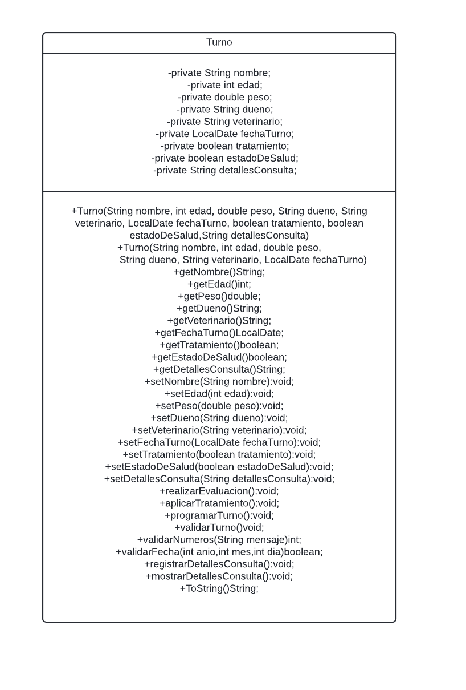

<!DOCTYPE html>
<html lang="en">
<head>
    <meta charset="UTF-8">
    <meta name="viewport" content="width=device-width, initial-scale=1.0">
    
</head>
<body>
    <h1>Parcial Ejercicio 1</h1>
    Para la Clínica Veterinaria "Amigos Peludos":
La Clínica Veterinaria "Amigos Peludos" requiere un sistema que permita organizar y gestionar los turnos de los animales que acuden a consulta. El programa debe ofrecer la posibilidad de registrar información relevante sobre cada turno y permitir la evaluación del estado de salud del animal durante la visita.
Además, el sistema debe contar con herramientas para que el veterinario realice un seguimiento de los aspectos clave de la salud del animal durante el turno. Esta información debe almacenarse de manera que pueda ser utilizada posteriormente para generar informes sobre el estado de cada paciente, determinando si requiere atención adicional o tratamiento.

  
    
    
    
</body>
</html>
